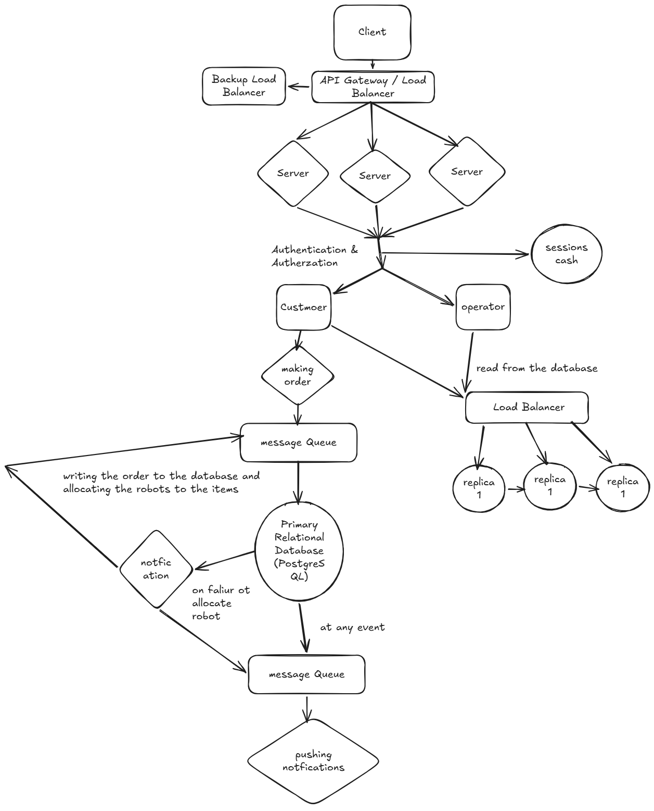

## Functional Requirements 
- Customers can create accounts
- Customers can browse products, add them to their cart, and order them, and they should be able to track the status of what they ordered in the real time, with notifications sent upon changes to this status
- Upon order being received, the system should validate the existence of the items and the counts in the inventory
- The system should make sure that the order is collected successfully and it is not collected twice
- The system will take the order and will generate the number of robots with the assigned items for them
- The system will send a check to each robot at a certain time interval to check their status, location, and battery level
- The system could receive from the robots the status of the item allocated to the robot
- The system will show a complete overview status for any order and any robots at any given time
- There is a notification alert for some of the important events, like low stock or a failure of any robot or fulfillment of any order, and you could specify the exact event you need to push notifications for
- The system should handle the failure of any robot at any time in the process
- The system should track the order as a whole unit and know if it is fully collected or not and track its status

## Non-Functional Requirements 
- For scalability, the system could scale horizontally and should handle over 100M orders per month and high read-to-write ratios (100:1 for search vs. ordering).
- The system should maintain a high level of availability and consistency
- The order confirmation for the customers should not take more than 500ms
- The time from receiving the order to the system and allocating the robots should not take more than 10 secs

## Data Model 
I chose PostgreSQL as the primary source of truth because the system contains highly related and transactional data, including:
- Users (user_id, name, age, location, payment_info)
- Products ( product_id, thumbnail_link, desc, price, vendor, category)
- Orders ( order_id, user_id , date, money)
- Order_items ( order_id, product_id)
- robots (robot_id, shelf_life, battry capactiy)
- items (item_id, product_id) 
- allocations (id, robot_id, item_id, order_id, date_started, date_fulfilled, status) A uniqueness validation will be on the item_id and robot_id to make sure that the same item is not picked twice if the status was completed
- notifications ( id, event, status)

## API Design 
I chose a RESTful HTTP architecture  because the domain revolves around well-defined, persistent resources and a data model. REST allows us to scale stateless API servers horizontally behind a load balancer and leverage standard HTTP caching for high-frequency queries like product listings.

| Endpoint | Request_body | Response | Purpose |
|---|---|---|---|
| `POST /users/{userId}/profile` | Profile data: name, locaion, cerdit_informatinns | Profile | Create/update custmoer profile |
| `POST /products` | product details, description, price. | product_id | Create a product |
| `PATCH /products/{product_id}` | Fields to update | Updated product | Update a product |
| `GET /products?keywords={keywords}&page={page}&limit={limit}` | Filters: keywords, price, category, pagination | Paginated products | Producs search |
| `GET /users/{userId}/profile` | the user_id | profile data (previous orders, name, location, and so on | get a user profile|
| `GET /orders/{userId}` | the user_id | orders_ids and info | get the order for a specific user |
| `GET /orders` | Filters: keywords, money, date, pagination | orders_ids and info| get all the orders|
| `POST /robots` | robot info | robot ID + status | add a robot to the fleet|
| `PATCH /robots` | robot info the needed to be updatted | robot ID + status | update the robot to the fleet|
| `DELETE /robots/{robot_id}` | robot_id | robot ID + status | delete a robot form the fleet|

## High-level architecture

---
- [Deep Dives](./deep_dives.md)

